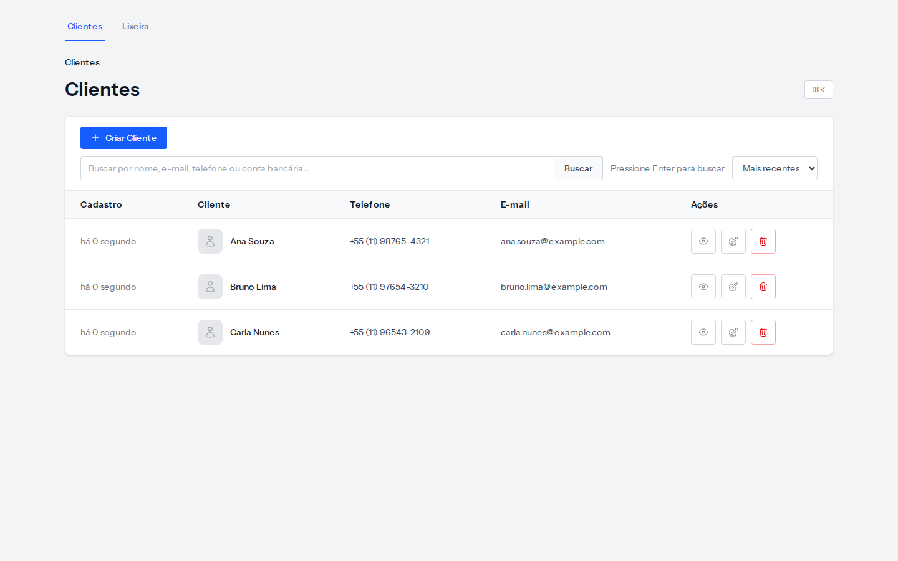
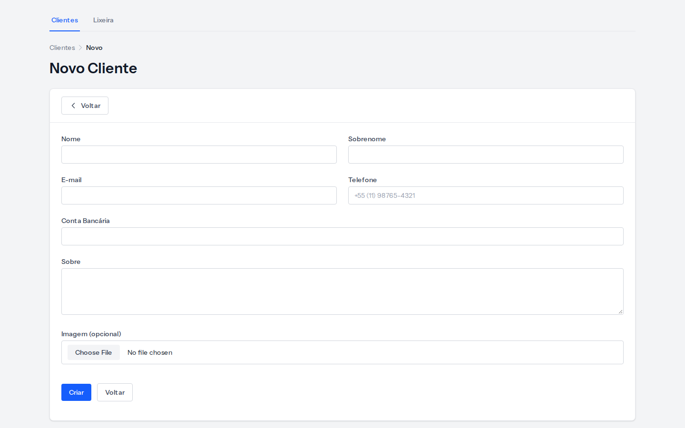
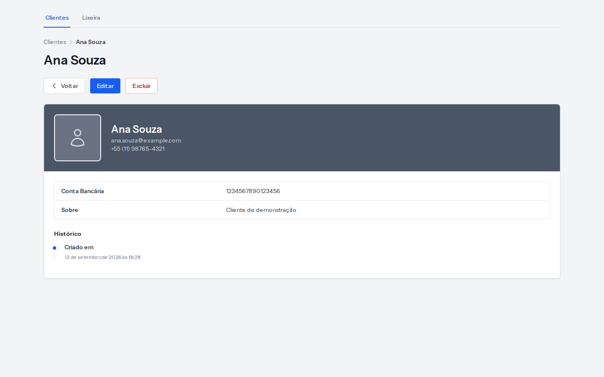
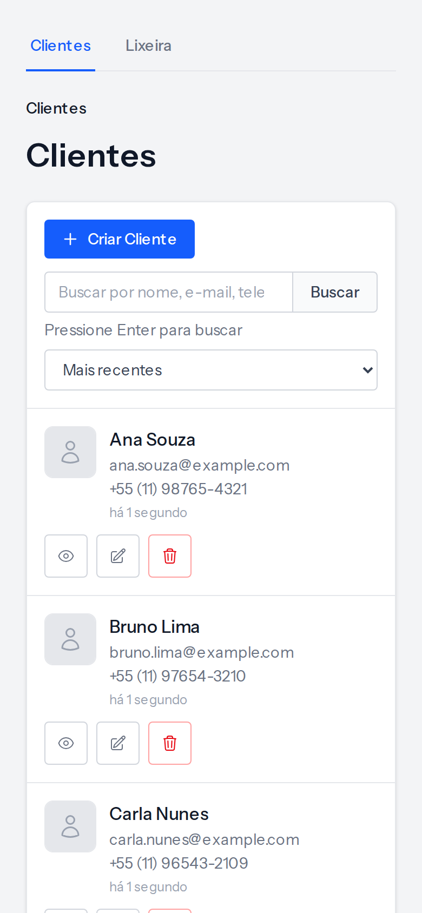

# Clientes

CRUD de clientes em Laravel 13, para estudo local. Interface em português (pt-BR), sem autenticação.

Não use em produção.

## O que o app faz

- Listagem com busca, ordenação e paginação
- Criar, editar, ver e excluir cliente
- Drawer lateral para criar e editar sem sair da lista
- Split view no desktop: o preview abre ao lado da lista
- Command palette com `Ctrl+K` / `⌘K`
- Soft delete com lixeira (restaurar ou excluir de vez; restauração exige e-mail livre entre ativos)
- Upload de foto, validação de formulário e toasts

## Requisitos

- [Docker](https://docs.docker.com/get-docker/) (PHP, Composer e Node rodam no Sail)

## Como subir

Na primeira vez (clone sem `vendor/`):

```bash
cp .env.example .env
docker run --rm -u "$(id -u):$(id -g)" -v "$(pwd)":/opt -w /opt laravelsail/php85-composer:latest composer install --ignore-platform-reqs
./vendor/bin/sail up -d
./vendor/bin/sail artisan key:generate
./vendor/bin/sail artisan migrate --seed
./vendor/bin/sail artisan storage:link
./vendor/bin/sail npm install
./vendor/bin/sail npm run build
```

Se o Composer já estiver no host, `composer install` no lugar do `docker run` também serve para gerar o `./vendor/bin/sail`.

App: http://localhost:8080/customers

Detalhes de portas, banco e comandos do dia a dia: [DOCKER.md](DOCKER.md).

## Interface

Capturas geradas a partir da instância E2E isolada (`http://127.0.0.1:8081`), com dados fictícios.









Para regenerar as imagens (com a instância E2E no ar):

```bash
npm run test:e2e:screenshots
```

## Testes

### PHP (PHPUnit)

Usam o banco MySQL `testing`. Não alteram o banco local `laravel`.

```bash
./vendor/bin/sail test
```

### E2E (Playwright)

Os testes de interface sobem uma instância HTTP própria na porta **8081**, com banco MySQL **`e2e`**, sessão `e2e-session` e disco público em `storage/app/e2e-public`. O setup aborta se `GET /__e2e/health` não confirmar `env`, `database` e `connection` iguais a `e2e`. Os bancos `laravel` e `testing`, o `.env` e os volumes do Sail não são recriados.

Requisitos neste ambiente WSL/Docker:

- Docker Desktop com integração WSL (MySQL e o container `laravel.e2e` usam a mesma rede `sail` do app local)
- App local já instalado (`vendor/`, `APP_KEY` no `.env`) — a instância E2E reutiliza a imagem `sail-8.5/app`
- Node no host (nvm) para o Playwright; no WSL: `nvm use` e `npm install`
- Navegadores: `npx playwright install chromium firefox` (WebKit exige `npx playwright install-deps`, com sudo)

Preparar e executar:

```bash
./scripts/e2e-up.sh
npm run test:e2e
```

`npm run test:e2e` roda Chromium (1440×900, suíte completa), Firefox (fluxos `@essential`) e Chromium emulado em 390×844 (`@mobile`).

Fluxos `@essential` no WebKit, quando as libs do host estiverem disponíveis:

```bash
npm run test:e2e:webkit
```

Encerrar só o HTTP E2E (preserva `laravel.test` e `mysql`):

```bash
./scripts/e2e-down.sh
```

O token de reset fica em `.env.e2e` (gerado na primeira subida; não versionar). Relatórios, traces e vídeos de falha ficam em `test-results/` e `playwright-report/` (gitignored). A subida usa `php artisan e2e:migrate-fresh`, que aborta se o banco efetivo não for `e2e`.

### Matriz de cobertura E2E

Última execução neste ambiente: **45** aprovados em `npm run test:e2e` (Chromium + Firefox `@essential` + Chromium móvel emulado) e **6** aprovados em `npm run test:e2e:webkit`. PHPUnit: **80** aprovados no banco `testing`.

| Área | O que foi exercitado | Onde |
|---|---|---|
| Acesso, lista, busca, ordenação, paginação, preview | UI | Chromium |
| Cadastro, edição, exclusão, listagem vazia | UI | Chromium, Firefox, WebKit |
| Upload, troca e preservação de foto; tipo inválido e arquivo > 2 MB | UI | Chromium |
| Sobre 1000/1001 caracteres | UI | Chromium |
| Telefone: máscara de 11 dígitos | UI | Chromium |
| Telefone `max:20` no request | HTTP | PHPUnit |
| Drawer de edição (carregar, salvar, cancelar) | UI | Chromium |
| Lixeira: cancelar exclusão permanente; e-mail reutilizado; restauração bloqueada se o e-mail já estiver ativo | UI | Chromium |
| 404 show/edit; restore inexistente; force 404 | UI/HTTP da instância E2E | Chromium |
| Teclado no formulário desktop | UI 1440×900 | Chromium |
| Cartões, cadastro, exclusão, Tab na busca | Emulação 390×844 | Chromium |
| Rotas `/__e2e/*` ausentes em 8080; reset sem token | HTTP | Chromium + PHPUnit |
| `imageUrl()` com prefixo `/storage` (não E2E) | HTTP | PHPUnit |
| `e2e:migrate-fresh` recusa ambiente `testing` | Artisan | PHPUnit |

O e-mail continua único entre clientes **ativos**. Cadastro e edição podem reutilizar o e-mail de alguém na lixeira. Restaurar (inclusive em lote) é bloqueado se outro ativo já usa o mesmo e-mail, com a mensagem “Não foi possível restaurar: já existe um cliente ativo com esse e-mail.”; o registro permanece na lixeira, inalterado. Outros itens na lixeira com o mesmo e-mail não impedem a restauração.

Apresentação (sem mudança de UI): o seletor nativo de arquivo aparece em inglês no Chromium; o placeholder da busca corta no viewport 390×844, mas a lista e os botões continuam acessíveis.

## Stack

Laravel 13 · PHP 8.5 · MySQL 8.4 · Tailwind CSS · Alpine.js · Laravel Sail

## Licença

MIT. Veja [LICENSE](LICENSE).
